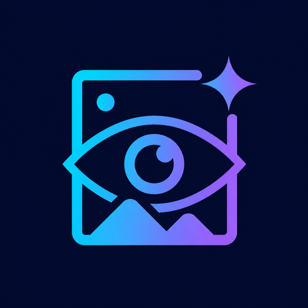

<div align="center">


[](README_EN.md)

</div>

<p align="center">
  
</p>

<h1 align="center">DeepSeek 识图技能</h1>

<p align="center">
  为 DeepSeek 打造的 Codex 识图技能：调用视觉 API 识别图片、提取文字，并分析截图、图表与表格。
</p>

<p align="center">
  <a href="https://github.com/llKengken/recognize-image-skill/stargazers">
    
  </a>
  
  
  
</p>

<p align="center">
  
</p>

## 功能特性

- 通过 OpenAI 兼容的视觉接口识别图片内容并生成描述。
- 从图片中提取文字，支持截图、扫描件、图表和表格分析。
- 安装后即可被 Codex 自动发现，无需额外安装依赖。
- 支持命令行手动调用，便于测试和自动化流程。
- 支持 PNG、JPG/JPEG、WebP、GIF、BMP、TIFF 图片格式。
- 密钥仅保存在本地 `config.json`，不会进入仓库。

## 快速开始

将 `recognize-image/` 目录复制到 Codex 个人技能目录：

```powershell
Copy-Item -LiteralPath .\recognize-image -Destination "$env:USERPROFILE\.codex\skills" -Recurse
```

然后新开一个 Codex 任务，技能会被自动发现。

要求 Node.js 18 或更高版本。如果 `node` 不在 PATH 中，可以使用 Codex 运行时自带的 Node（可通过 `load_workspace_dependencies` 获取路径）。

### 一键安装提示词

在 Codex 中发送以下提示词，即可自动安装、配置并测试该技能：

```text
请用 skill-installer 从 https://github.com/llKengken/recognize-image-skill 安装 recognize-image 技能到 ~/.codex/skills；读取 recognize-image/config.example.json 创建 recognize-image/config.json 并配置 apiUrl 和 apiKey；最后用一张图片测试识别功能。
```

### 文件结构

```text
recognize-image/
├── SKILL.md                 # 技能说明
├── config.example.json      # 配置模板
├── agents/
│   └── openai.yaml          # 界面元数据
└── scripts/
    └── recognize.js         # 视觉 API 调用脚本
```

## 配置

复制配置模板：

```powershell
Copy-Item .\recognize-image\config.example.json .\recognize-image\config.json
```

编辑 `recognize-image/config.json`，在 `apiKey` 字段填入你自己的密钥：

```json
{
  "apiUrl": "https://api.daseinai.xyz/v1/chat/completions",
  "apiKey": "",
  "model": "gpt-5.6",
  "maxOutputTokens": 2000,
  "requestTimeoutMs": 120000,
  "maxRetries": 2
}
```

| 字段 | 说明 | 默认值 |
| --- | --- | --- |
| `apiUrl` | 完整的 chat-completions 接口地址 | 模板中的地址 |
| `apiKey` | 用于 Bearer 认证的 API 密钥 | 空字符串 |
| `model` | 视觉模型 ID | `gpt-5.6` |
| `maxOutputTokens` | 单次请求最大输出 token 数 | `2000` |
| `requestTimeoutMs` | 请求超时时间（毫秒） | `120000` |
| `maxRetries` | 失败重试次数（429/5xx 与网络错误） | `2` |

`config.json` 已被 `.gitignore` 忽略，请勿提交真实密钥。

优先级从高到低：命令行参数（`--api-url`、`--api-key`、`--model`）> 环境变量（`VISION_API_URL`、`VISION_API_KEY`、`VISION_API_MODEL`）> `config.json`。

## 使用示例

手动调用：

```powershell
node recognize-image/scripts/recognize.js "path/to/image.png" --prompt "请描述这张图片的内容，并尽量识别图中所有文字。"
```

常用提示词示例：

| 场景 | 提示词 |
| --- | --- |
| 通用描述 | `请描述这张图片的内容。` |
| 文字提取 | `请识别图片中的所有文字，保持原文顺序。` |
| 截图分析 | `这是一张界面截图，请说明界面的用途、主要元素和关键信息。` |
| 图表或表格 | `请读取图表/表格中的数据并总结结论。` |

脚本支持以下参数：

| 参数 | 说明 |
| --- | --- |
| `--prompt` | 自定义识别提示词 |
| `--config` | 指定 `config.json` 路径 |
| `--api-url` | 临时覆盖接口地址 |
| `--api-key` | 临时覆盖 API 密钥，不推荐在命令行直接使用 |
| `--model` | 临时覆盖模型 ID |
| `--max-output-tokens` | 覆盖最大输出 token 数 |
| `--max-size-mb` | 图片大小上限，默认 `10` MB |

## 安全说明

- 本仓库不包含真实 API 密钥或 GitHub Token。
- `recognize-image/config.json` 已被 `.gitignore` 忽略，请勿提交。
- API 密钥只应保存在本地配置或环境变量中，不要写入命令历史、日志或聊天内容。
- 如需临时覆盖密钥，优先使用环境变量，而不是命令行参数。

## 许可证

本项目采用 MIT License，详见 [LICENSE](LICENSE)。
